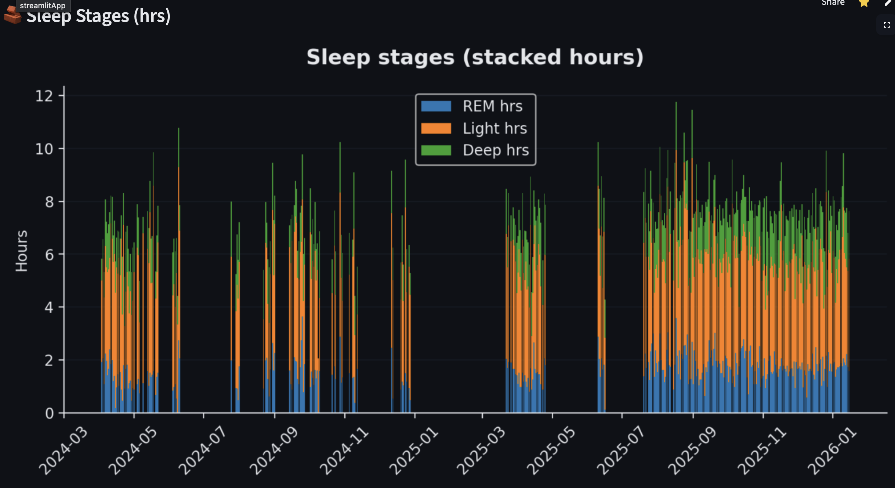

# 🏋️‍♂️ Rehab Strength Dashboard

A personal analytics dashboard built with **Streamlit** to track **workouts, sleep, and recovery** over time, with a strong focus on **data integrity, transparency, and rehabilitation monitoring**.

---
## 📸 Dashboard Preview

### Home

### Recovery

### Sleep

---
## 🎯 Why this project exists

This app was created out of a **real personal need**.

After experiencing a **Cerebrovascular Accident (CVA)**, I needed a reliable way to:
- track physical rehabilitation progress,
- monitor training load and recovery,
- understand how sleep and physiological signals affect performance,
- and **avoid misinterpreting incomplete or delayed data**.

Most fitness apps show numbers without context.  
This dashboard is designed to show **what the data actually represents, how recent it is, and how confident we should be when interpreting it**.

---

## 🧠 What the dashboard does

The app integrates **three independent data sources**:

### 🏋️ Workouts (Strong)
- Exercise-level tracking
- Estimated 1RM (Epley formula)
- Weekly volume and RPE trends
- Pre vs post CVA comparisons

### 😴 Sleep (Sheets export)
- Sleep score
- Sleep stages (REM / Light / Deep)
- Wake count
- Longitudinal trends

### 🧠 Recovery (Sigmoid model)
- Composite recovery score (0–1)
- Components such as HRV, stress, resting heart rate
- Transparent visualization of trends and variability

---

## 📊 Key features

- **Weekly snapshot** (not noisy daily metrics)
- **Data freshness badges**  
  Clearly shows how many days old each data source is
- **Integrity-first design**  
  The app never assumes “today’s data” if it doesn’t exist
- **Collapsed upload panel** after data is loaded
- **Correlation analysis** using weekly aggregation (appropriate for 3–4 training days/week)
- Dark mode support 🌙

---

## ⚠️ Data integrity philosophy

This dashboard is intentionally conservative.

- If data is delayed, it is shown as delayed
- No forward-filling or artificial alignment
- Weekly aggregation is preferred when frequencies differ
- Visual cues explain *how confident* we should be in the metrics

This is especially important in a **rehabilitation context**, where misinterpreting trends can lead to poor decisions.

---

## 🧩 Architecture overview

- Upload → normalize → store in `st.session_state`
- UI widgets never re-read raw files
- All downstream logic reads from validated in-memory data
- Deterministic behavior across reruns and tab changes

---

## 🚀 Tech stack

- **Python**
- **Streamlit**
- **Pandas / NumPy**
- **Matplotlib / Seaborn**

---

## 📈 Versioning

All changes are tracked in [`CHANGELOG.md`](./CHANGELOG.md), following semantic versioning principles.

---

## 🔒 Privacy

This project is for **personal use**.
No raw personal data, API keys, or ingestion scripts are published.

Only cleaned CSVs are uploaded manually.

---

## 📌 Disclaimer

This tool is **not a medical device**.
It is intended for **personal tracking and insight**, not diagnosis or medical advice.

---

## 🙌 Closing note

This project represents a transition from:
> “just tracking numbers”  
to  
> **understanding recovery, uncertainty, and progress over time**.

It is both a technical project and part of an ongoing rehabilitation journey.

